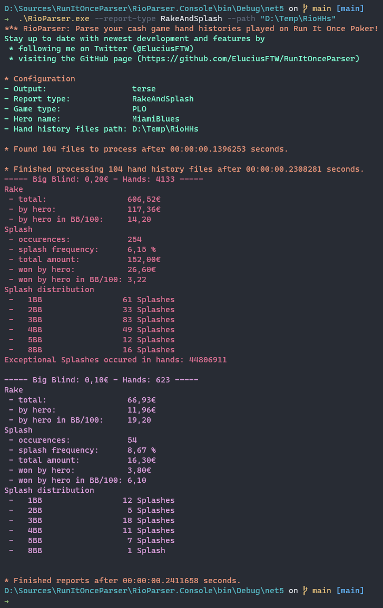

# RunItOnceParser
RunItOnceParser is a CLI tool to analyze hand histories from [Run It Once Poker ](https://www.runitonce.eu/).

## Usage
Execute "RioParser.exe --help" to see all available options in the console.

* --path: Path to the folder containing the hand history files to analyze (Required).
* --hero: The screen name to be used as a reference. If none is given, only general statistics will be shown.
* --Verbose: Set this flag to receive more output to the console. 
* --game-type: Set filter for a specific game: PLO or NLH.
* --report-type: Set report type: Rake, Splash, RakeAndSplash.

Preview of the output of a RakeAndSplash report:



### Exceptional Splashes
In the screenshot above you see that an exceptional splash occurred in hand 44806911. This means that the hand had a splash of _more than 100BBs_. RunItOnce does not show the outcome of these exceptional splashes in the hand histories directly - you can only look at all hole cards, the board and then determine the winner by yourself. This is not yet possible in the tool. Here is the history for the above mentioned hand:

````
Run It Once Poker Hand #44806911:  Omaha Pot Limit (€0.10/€0.20) - 2020/05/13 21:33 UTC [2020/05/13 22:33 CET]
Table ID '44806293' 6-Max Seat #1 is the button
Seat 1: Kortney K (€39.76 in chips)
Seat 3: Jordan I (€20 in chips)
Seat 4: MiamiBlues (€43.68 in chips)
Seat 5: Stephanie M (€15.20 in chips)
Seat 6: Ryder V (€44.38 in chips)
*** HOLE CARDS ***
STP added: €200.00
Dealt to Jordan I [Qc 8c 8s Ad]
Dealt to MiamiBlues [Kh Ts Kd Ac]
Dealt to Stephanie M [2d As 9s 8h]
Dealt to Ryder V [Jh 5s 9h 3h]
Dealt to Kortney K [7s 9d 4s Ah]
*** SUMMARY ***
Total pot €200.00 | Main pot €140.00 | Side pot €60.00 | STP €200.00 | Rake €0.00
Board [4h Tc Td 3d 6c]
Seat 1: Kortney K (button) 
Seat 3: Jordan I 
Seat 4: MiamiBlues 
Seat 5: Stephanie M 
Seat 6: Ryder V 
````

## Coming soon
* -- Filter by handedness in Cash game (heads up, 3-handed, ... , 6-handed)
* -- More report types: Cub3d, SnG.

## Prerequisites
In order to build the project, you need to have the [NET5.0 SDK](https://dotnet.microsoft.com/download/dotnet/5.0) installed.

## Contribute
All contributions are welcome!
