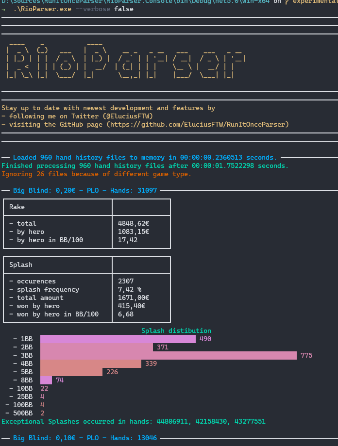
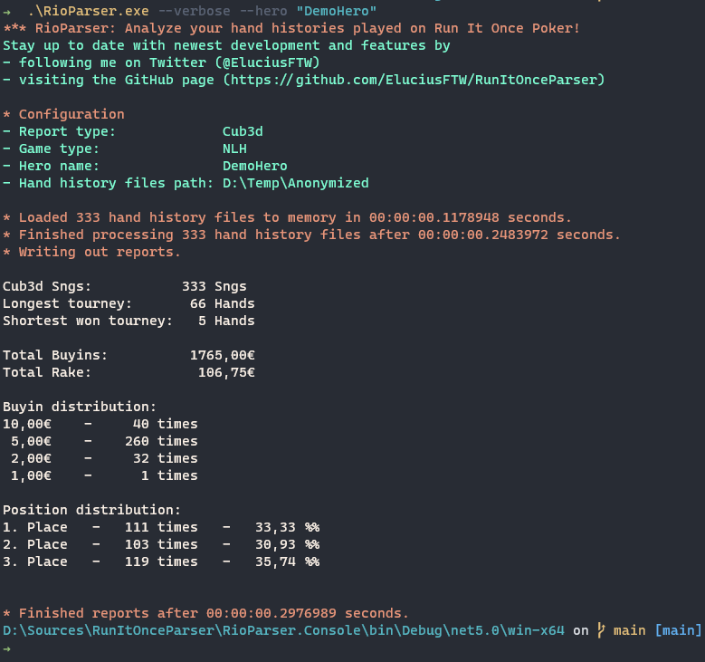

RunItOnceParser
=====
RunItOnceParser is a CLI tool to analyze hand histories from [Run It Once Poker](https://www.runitonce.eu/). 

## Usage

Like you'd expect from a command line interface you can call the executable with several different parameters:

* **path**: Path to the folder containing the hand history files to analyze (Required).
* **hero**: The screen name to be used as a reference. If none is given, only general statistics will be shown.
* **game-type**: Set filter for a specific game: PLO or NLH.
* **report-type**: Set report type: Rake, Splash, RakeAndSplash.
* **verbose**: Set this flag to receive more output to the console. 
* **help**: Lists all available options and their valid values.

```PS
.\RioParser.exe --path "d:\some-folder" --hero Batman --game-type PLO --report-type Splash 
````

Alternatively, you can set standard values in the configuration.json. Options you set via flags take precedence, but if an option is not explicitly set via a flag, the ones from the config file will be used. This is what the configuration.json looks like:
```javascript
{
  // Full path to folder where hand histories are, e.g., "C:\Poker\MyHandHistories"
  "path": "C:\\Poker\\MyHandHistories",

  // Valid game types: PLO, NLH
  "GameType": "NLH",

  // Valid report types:
  //  - Rake, Splash, RakeAndSplash (cash game)
  //  - Sng, Cubed (for tourneys)
  "ReportType": "Cub3d"
}
````

## Cash game reports
Currently you can analyze your cash game hands with three different reports: *Rake*, *Splash* and *RakeAndSplash*. The reports will be generated for each stake separately, and only for the given game type.

### Exceptional Splashes
There are exceptional splasehs, i.e., hands where the action is not on the players but instead the hand plays out randomly. These hands have different hand histories, and in particular they don't have the results computed (you can only look at the hole cards of all players, and the board, and deretmine it yourself). This is not yet possible in the tool, so instead the splash report will list you the hand identifiers of the exceptional splashes and you can look for yourself. For reference, here is an example of an exceptional splash hand (it is the one referenced in the screenshot of a *RakeAndSplash* report below):

````
Run It Once Poker Hand #44806911:  Omaha Pot Limit (€0.10/€0.20) - 2020/05/13 21:33 UTC [2020/05/13 22:33 CET]
Table ID '44806293' 6-Max Seat #1 is the button
Seat 1: Kortney K (€39.76 in chips)
Seat 3: Jordan I (€20 in chips)
Seat 4: MiamiBlues (€43.68 in chips)
Seat 5: Stephanie M (€15.20 in chips)
Seat 6: Ryder V (€44.38 in chips)
*** HOLE CARDS ***
STP added: €200.00
Dealt to Jordan I [Qc 8c 8s Ad]
Dealt to MiamiBlues [Kh Ts Kd Ac]
Dealt to Stephanie M [2d As 9s 8h]
Dealt to Ryder V [Jh 5s 9h 3h]
Dealt to Kortney K [7s 9d 4s Ah]
*** SUMMARY ***
Total pot €200.00 | Main pot €140.00 | Side pot €60.00 | STP €200.00 | Rake €0.00
Board [4h Tc Td 3d 6c]
Seat 1: Kortney K (button) 
Seat 3: Jordan I 
Seat 4: MiamiBlues 
Seat 5: Stephanie M 
Seat 6: Ryder V 
````



## Tourneys
So far RunItOnce offers two different formats of single table tournaments: Classic Sngs and Cub3d ones. 
For both you can generate a similar report, using hte report-type **Sng** resp **Cub3d**.

Here is a screenshot of a current cub3d report on a small test sample:



## Coming soon
* Filter by handedness in Cash game (heads up, 3-handed, ... , 6-handed)
* Incorporating tourney summaries and results for Cub3d and SnG reports.

## Contribute
All contributions are welcome!
### Prerequisites
In order to build the project, you need to have the [NET5.0 SDK](https://dotnet.microsoft.com/download/dotnet/5.0) installed.

